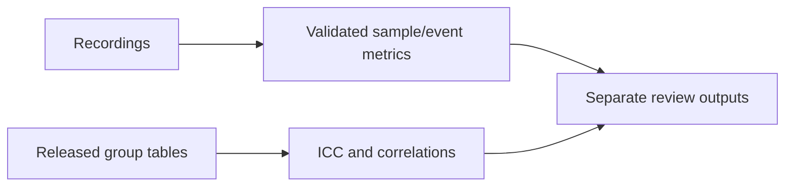
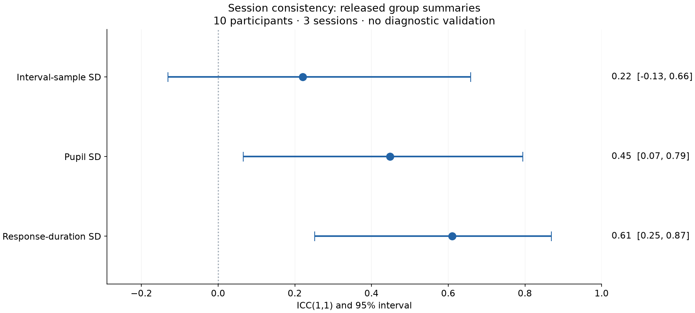
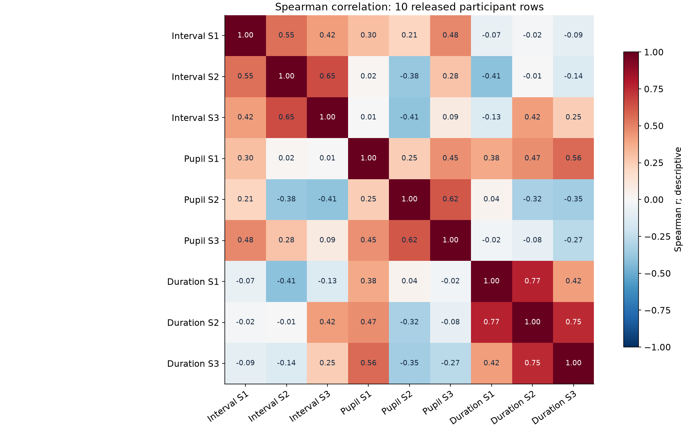

# Multimodal-Multisensor

**10 adults · 3 weekly sessions · eye, cardiac and questionnaire data**

## Overview

| Release | Contents |
| :--- | :--- |
| Sources | 51 CSVs · 24 raw streams · 33 notebooks |
| Instruments | HADS · STAI-S · STAI-T · BFI-10 · Fear Questionnaire |
| Modalities | Eye/cardiac available; GSR attempted; facial integration unfinished |

## Data flow



## Results

**ICC(1,1) · n=10 · 3 sessions · 95% intervals**

| Within-session SD | ICC | Interval |
| :--- | ---: | :--- |
| Interval samples | 0.22 | −0.13 to 0.66 |
| Pupil | 0.45 | 0.07 to 0.79 |
| Response duration | 0.61 | 0.25 to 0.87 |




## Setup


## Verify

```sh
python -m pip install -e '.[dev]'
python -m pytest tests -q
python -m pipeline.build_group_summaries --check
```

**Python 3.11/3.12** · [Notebook and hashed-install commands](CONTRIBUTING.md)

## Limits

- **10 participants:** wide uncertainty; no diagnostic or stable-trait validation.
- **Sampled intervals:** unique beats and cross-stream clock alignment unverified.
- **Source gaps:** 2 suspected duplicate patterns; most group rows cannot be rebuilt.

## Tech stack

| Layer | Tools |
| :--- | :--- |
| Analysis | Python · NumPy · pandas · SciPy |
| Exploration | Jupyter · scikit-learn |
| Figures | Matplotlib |

## Ethics and data use

Sharing/photo consent recorded; residual dates/device labels remain. [Consent](DATA_ETHICS.md) · [Terms](DATA_LICENSE.md) · [Instrument rights](NOTICE.md)

## Sources

[Technical report](docs/reports/Multimodal%20Multisensor%20Technical%20Report.pdf) · [Thesis](docs/reports/Thesis%20Report.pdf) · [Proposed protocol](docs/reports/CYPSY_Poster.pdf)

[Corrections](docs/REPORT_STATUS.md) · [Figures](docs/FIGURES.md) · [Data contract](DATA_PROVENANCE.md)

[Sensor](https://github.com/urmeo/Sensor) · [Psychometric](https://github.com/urmeo/Psychometric) · [CalmSense](https://github.com/urmeo/CalmSense)

**Keywords:** recordings · sessions · variability · uncertainty

Code: [MIT](LICENSE). Data: [separate terms](DATA_LICENSE.md).
